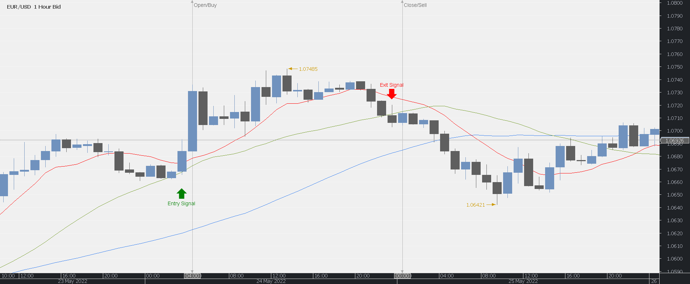
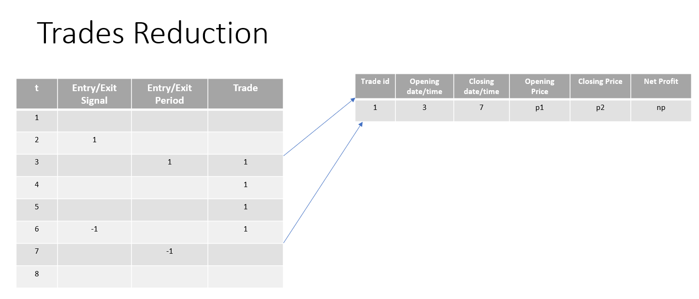

# Outliers are Liars

Author: Marcello Chiuminatto  
Python version: 3.10.4

## Overview

In the context of FOREX trading, in the commitment for finding profitable trading strategies, you will find in books, articles, papers, web sites and maybe from your own inspiration, strategies that shows positive profits, based on cumulative profit over a period. Well, that is not enough unfortunately, because does not necessarily indicate consistency in the profits.

Would be profit average (expected profit) then be a good indicator of profits consistency? The answer is not straight forward: not necessarily. Why? and the answer to this question is the topic of this analysis: Outliers. 

Outliers will distort the reading of cumulative profits and expected profits in such a way that a losing strategy, can look like a profitable one.

Consider the following example:
Let's define a strategy S, from which we get a sample of 50 trades whose profits are distributed as shown in the next table:

|        |Trades | Profit/trade[pips] |Total Profit[pips]|
|--------| ------|--------------------|------------------|
|        |  25   |   -5.0             |        -125.0    |    
|        |  24   |   2.0              |          48.0    |
|        |  1    |  200.0             |         200.0    |
|--------|-------|--------------------|-------------------
| Total  |  50   |                    |         123.0    |
| mean   |       |                    |         2.5      |
| median |       |                    |         -1.5     |

Total profit and average profit are positive, but clearly this is strongly influenced by the 200 pip trade. Pay close attention to median though, is telling something about this case.

Based on a real but simple trading strategy, it will be shown how outliers impacts mean and total profits, however median signals that something is hidden behind the scenes.

Throughout this article, it will be shown with a real, but simple trading strategy, the danger of not paying attention to outliers and in the process of showing so, it is presented the trading strategy research life cycle: design / back-testing, analysis, and conclusions.

## Strategy Design

### Definitions and Concepts

This strategy is one of the simplest trend-following or momentum FOREX trading strategy.

For simplicity, this analysis focuses only on buying (long) strategy.

The rationale behind the strategy is the following: *“When price “accelerates” enough to the upside it is likely that will remain that way for a while, so is a good signal for opening a buying position and keep it open until market decelerate.”*

To have an actionable and testable strategy is necessary to define in mathematical terms the concepts involved in the above statement: acceleration and deceleration. It necessary to remark that these concepts are defined in the context of this trading strategy analysis only and under no way are general concepts that can necessarily be applied to ALL trading strategies or financial markets.

Being that said and reducing the abstraction level a bit, market acceleration is defined as: when prices close above a fast-moving average, which is above a medium-moving average, which at the same time is above a slow-moving average.

Market deceleration is defined as: when the fast-moving average cross below the medium-moving average.

**What is a Moving Average (MA) of $n$ periods?**

It is the average of the last $n$ available price periods. Generally, is calculated on close price (which is the case for this research), but can also be calculated on open, high, low, typical price etc.)

Mathematically:

$MA(close;n)=\frac{1}{n}\sum_{i=t-n+1}^{i=0} close_i$

*Simple moving average on close parametrized with n (periods)*

Where:

- $n$ Number of periods
- $close_i$: close price at i-th period

*What are fast, medium and slow moving averages?*

The concept of speed for a MA's is given by the number of periods the MA is calculated on; less number periods will make the MA to react *faster* to price action whilst greater number of periods will make it *slower*.

In this context the periods for the three different MA are defined as follows:

* Fast MA ($MA_f$): 10 periods
* Medium MA ($MA_m$): 25 periods
* Slow MA ($MA_s$): 50 periods

### Long entry/exit rules

Now it is time to concretely define the strategy Entry/Exit/Management rules.

 **Entry**  
  Enter long when close cross above $SMA_f$ and $SMA_f$ is above $SMA_m$ and $SMA_m$ is above $SMA_s$
  
  Mathematically:
  
  Enter long when the following two conditions are true
  
  1. $close_{t-1}<SMA_f \land close_t > SMA_f$
  2. $SMA_s < SMA_m < SMA_f$
 
  **Exit**   
  Exit a long position when $close_i$ cross below $SMA_m$

  Mathematically

  Exit when
  1. $close_i < SMA_m < close_{i-1}$
   

## Strategy Back-Testing

Strategy back-testing is in essence simulating the strategy logic on historic data, expecting that past performance will repeat in the feature. But this is not necessarily the case and depends a lot on how the back-testing process is designed and executed, among other conditions. Detailed back-testing discussion is out of the scope of this analysis. As a starter you can find more here: https://www.investopedia.com/terms/b/backtesting.asp.

What is relevant for this analysis is that back-testing will produce a set of trades that if considered right out of the process they seem to be produced by a profitable strategy, but hypothetically this is not true and the real losing results are hidden by outliers.

In this section are presented some steps to implement a simple *vectorized* back-testing process. The term **vectrorized** means that instead of looping throughout the elements of an array or a matrix performing scalar operations, the operations are performed on entire arrays or matrices (vectors). Why to do so? because the reduction of processing time is significant, specially when working with millions or billions of records. You can find more here: https://www.youtube.com/watch?v=BR3Qx9AVHZE

### Data

The data for this study is for the instrument (currency cross pair) EURUSD, format OHLC (Open/High/Low/Close) aggregated at a fix frequency of one hour (H1) in the period from 2015-01-01 22:00:00 until 2021-11-24 23:00:00

Sample:

| Time (UTC) | Open | High | Low | Close | Volume |
| --- | --- | --- | --- | --- | --- |
| 2021-11-24 19:00:00 | 1.11925 | 1.12034 | 1.11883 | 1.11985 | 3332.690 |
| 2021-11-24 20:00:00 | 1.11984 | 1.12053 | 1.11976 | 1.12050 | 1500.710 |
| 2021-11-24 21:00:00 | 1.12049 | 1.12054 | 1.11962 | 1.11962 | 1051.825 |
| 2021-11-24 22:00:00 | 1.11957 | 1.12020 | 1.11944 | 1.12001 | 662.320 |
| 2021-11-24 23:00:00 | 1.11997 | 1.12042 | 1.11997 | 1.12025 | 465.710 |

### Feature Calculation
Besides price, the three moving averages need to be calculated: $SMA_f$ (fast), $SMA_m$ (medium) and $SMA_s$ (slow).

The image belo shows the three SMA plotting.

### Strategy Vectorization

For this strategy, the required steps for vectorization are the following:

* Mark entry and exit signal
* Mark trading periods
* Reduce trading periods to trades
* Calculate profits

These steps that are followed here are not mandatory and can and probably will change from strategy to strategy, from trader to trader and for many other reasons.

Worth to mention that key tools for vectorization are python libraries: Numpy and Pandas.

####  Marking Entry and Exit Signal

A signal is a flag a light or anything indicating that some condition has been reached and someone or something must execute an action accordingly.

In the case of this strategy and depending on the required action that needs to be triggered, there are two kind of signals: entry signal, triggering a buy action to open a position, and exit signal, triggering a sell action to close a position.

In the context of this strategy also, the signals are calculated and risen once a period is closed, when period's close price is available and therefore it is possible to calculate all moving averages based on it. This is not the only approach though, some strategies could trigger signals based on tick data arriving each second for example, when a period is not yet closed.

Remember that this is a buy only (long) strategy, so the signal space is limited. Broader strategies could have wider signal spaces, containing for example entry, adjust, increase size, decrease size, close signals, to name a few.

<b>Entry Signal: Cross over condition</b>

The entry signal is risen when the last available close price crosses above the fast SMA, along with fast SMA being above med SMA and med SMA being above the slow SMA.

$signal_i = (open_{i} < SMA_{fast, i} < close_{i})  \land (SMA_{slow, i} < SMA_{med, i} < SMA_{fast, i})$

Where:

* $Close_{i}$: Last closed bar close price.
* $Open_{i}$: Last closed bar open price.
* $SMA_{fast, i}, SMA_{med, i}, SMA_{slow, i}$: SMA fast, med and slow respectively, calculated at the last bar close.

<b>Entry period</b>

The entry period is marked right at the opening of current bar, if signal was risen for the last closed bar.

$entry_i=\begin{cases}
    1 \text{ if }signal_{i-1} = True\\
    \emptyset \text{ otherwise}
\end{cases}
$

Where:

* $entry_i$: Indicates if a trade needs to be opened at current period.
* $signal_{i-1}:$ Signal at last closed bar.

<b>Exit Signal</b>

The exit signal is risen when the close price crosses below the med SMA, therefore, following the entry.

<b>Exit Signal</b>

$x\_signal_i = close_{i} < SMA_{med, i} < close_{i-1}$

<b>Exit Signal</b>

$exit_i = \begin{cases}
    -1 \text{ if }x\_signal_{i-1} = True \\
    \emptyset \text{ otherwise}
\end{cases}
$

In the example below:

| t | Entry/Exit Signal | Entry/Exit Period | Trade |
| - | ----------------- | ----------------- | ----- |
| 1 |                   |                   |       |
| 2 | 1                 |                   |       |
| 3 |                   | 1                 | 1     |
| 4 |                   |                   | 1     |
| 5 |                   |                   | 1     |
| 6 | \-1               |                   | 1     |
| 7 |                   | \-1               |       |
| 8 |                   |                   |       |

- $t=2$: entry signal risen at the close of 2nd bar.
- $t=3$: entry condition is met, so a long trade is open right at the opening of the 3rd bar.
- $t=6$: exit signal is risen at the close of 6th bar.
- $t=7$: exit condition is met, so the trade is closed right at the opening of the 7th bar.

The following image shows entry/exit period example

The following image shows trading periods marking.

#### Trade Reduction

This process is also part of the strategy vectorization and consists of transforming from period-wise trade markings to trade-wise records. The attributes that define a trade could be open date/time, close date/time, open price, close price, number of trading periods, to name a few. What attributes to include is a decision that depends on the problem's context. In this case open date/time, close date/time and gross profit are enough.

| trade\_id | gross\_profit | date\_open      | date\_close     |
| --------- | ------------- | --------------- | --------------- |
| 1         | \-40.1        | 1/12/2015 4:00  | 1/12/2015 8:00  |
| 2         | \-38.7        | 1/22/2015 9:00  | 1/22/2015 13:00 |
| 3         | \-47.1        | 1/30/2015 11:00 | 1/30/2015 12:00 |
| 4         | \-18.3        | 2/3/2015 1:00   | 2/3/2015 3:00   |
| 5         | 94            | 2/3/2015 11:00  | 2/4/2015 9:00   |
| ...       | ...           | ...             | ...             |
| 620       | \-34.3        | 10/29/2021 1:00 | 10/29/2021 8:00 |
| 621       | \-14.7        | 11/2/2021 11:00 | 11/2/2021 13:00 |
| 622       | 13.4          | 11/8/2021 11:00 | 11/9/2021 11:00 |
| 623       | \-10.9        | 11/9/2021 14:00 | 11/9/2021 15:00 |
| 624       | \-8.7         | 11/10/2021 0:00 | 11/10/2021 2:00 |

### Profit Calculations

With trades in place, now it is possible to perform profits calculations along with some profits related metrics.

In the context of this study, one profit related calculation is required: net profit, which is the result of subtracting trade cost from gross profit:

$NP = GP - Cost$

Where

$NP$: Net Profit 
$GP$: Gross Profit 
$Cost$: Trading Cost 

**Trading Cost**

Usually overlooked, Trading Cost is a critical variable that can make the difference between a profitable strategy and a losing one. Maybe you have read books, papers or publications that shows very profitable strategies not mentioning trading cost though. Most probably is they didn't consider it, because if they did, the strategy wouldn’t be as profitable as they presented it.

More detail on trading cost calculation is out of the scope of this study and deserve an analysis by itself, enough is to say that its calculation is a function of spread and commission. The value used in this analysis is 0.5 pips per trade

The following image presents the gross and net profit for the strategy under analysis.

| trade\_id | gross\_profit | date\_open      | date\_close     | net\_profit | cum\_profit |
| --------- | ------------- | --------------- | --------------- | ----------- | ----------- |
| 1         | \-40.1        | 1/12/2015 4:00  | 1/12/2015 8:00  | \-40.6      | \-40.6      |
| 2         | \-38.7        | 1/22/2015 9:00  | 1/22/2015 13:00 | \-39.2      | \-79.8      |
| 3         | \-47.1        | 1/30/2015 11:00 | 1/30/2015 12:00 | \-47.6      | \-127.4     |
| 4         | \-18.3        | 2/3/2015 1:00   | 2/3/2015 3:00   | \-18.8      | \-146.2     |
| 5         | 94            | 2/3/2015 11:00  | 2/4/2015 9:00   | 93.5        | \-52.7      |

#### Profit Metrics

|Metric|Value|
|------|-----|
total_trades 	  | 624
winning_trades 	  | 184
losing_trades 	  | 440
total_pl 	      | 857.3
total_profit 	  | 8486.3
total_loss 	      | -7629.0
stdev_pl 	      | 43.93
stdev_cum_pl 	  | 372.23
avg_profit 	      | 1.37
median_profit 	  | -8.25

**Observations**

Winning trades proportion: 184 out of 624 trades are winning ones. A 29.5%, or roughly a third.

The average profit is 1.37 pips, the median is -8.25 though. 

The profit distribution chart shows that the distribution is right tailed.

